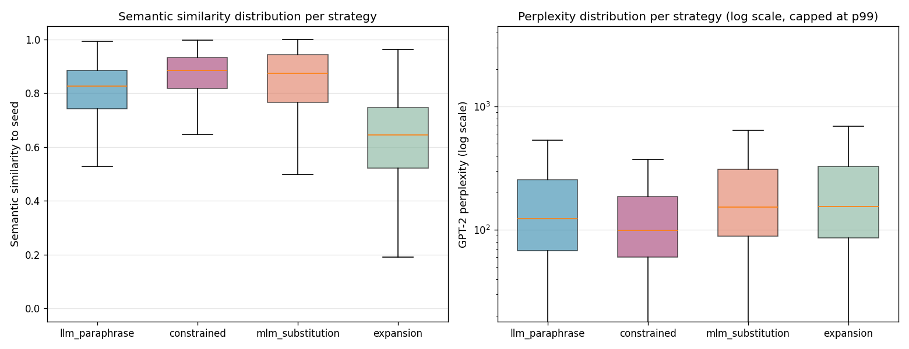
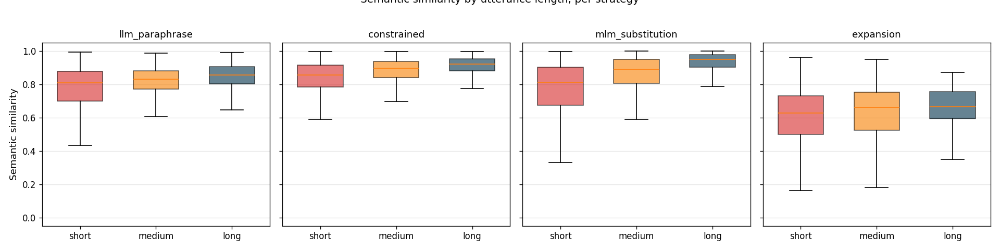
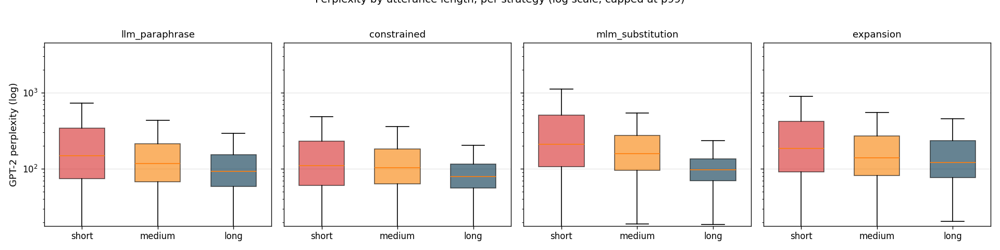
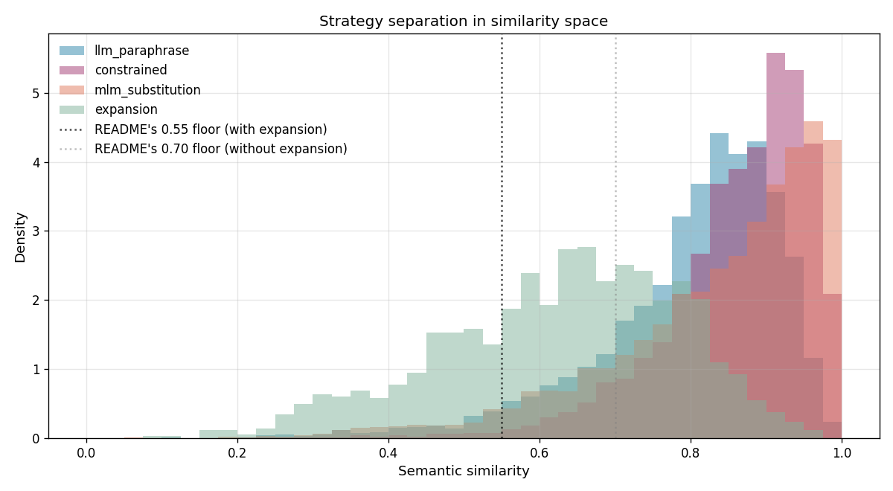

# Scoring ranges: per-strategy similarity and perplexity distributions

This experiment measures the semantic similarity and perplexity distributions produced by each of allo's four generation strategies. It establishes the empirical basis for the README's "Interpreting scores across strategies" guidance and surfaces three specific limitations in the scoring metrics that users should know about when setting filter thresholds.

## Method

The study analyses 16,962 variants from the volume sweep run at `--n = 50` across 117 seeds. `--n = 50` was chosen because it is the smallest `--n` where every strategy produces at its full capacity: constrained rewriting reaches its `n_per_constraint = 3` ceiling, MLM substitution is unrestricted on medium and long seeds, LLM paraphrasing still runs at 88% efficiency, and expansion produces 12 variants per seed.

All runs used the default configuration: temperature 0.9, `include_expansion=True`, `gpt-4o-mini` as the LLM backend. Similarity scoring uses `all-MiniLM-L6-v2` and perplexity scoring uses GPT-2 (allo's only supported scoring models).

Scripts live in `evaluation/studies/`:

- `scoring_ranges.py` — aggregates the raw per-(seed, n) allo CSVs from the volume sweep into a long-format variant-level table
- `scoring_ranges_analysis.ipynb` — produces the tables, figures, and findings cited in this document

The aggregate is committed at `evaluation/results/scoring_ranges/scoring_ranges_aggregate.csv`; figures and summary CSV are in the same directory.

Two methodological caveats apply and are documented alongside the findings:

- **Temperature-conditional.** Distributions reflect temperature 0.9. Future studies will analyze performance at lower temperatures.
- **Length-sensitive perplexity.** GPT-2 perplexity runs higher on shorter sequences for mechanical reasons. Cross-strategy perplexity comparisons are partially confounded by variant-length differences.

## Headline: per-strategy distributions

Per-strategy descriptive statistics across all 16,962 variants:

| strategy | n | metric | p25 | median | p75 | p95 |
|:---|---:|:---|---:|---:|---:|---:|
| llm_paraphrase | 5154 | similarity | 0.74 | 0.83 | 0.89 | 0.94 |
| constrained | 5144 | similarity | 0.82 | 0.89 | 0.93 | 0.98 |
| mlm_substitution | 5275 | similarity | 0.77 | 0.87 | 0.94 | 0.99 |
| expansion | 1389 | similarity | 0.52 | 0.64 | 0.75 | 0.85 |
| llm_paraphrase | 5154 | perplexity | 68 | 123 | 254 | 911 |
| constrained | 5144 | perplexity | 60 | 99 | 186 | 661 |
| mlm_substitution | 5275 | perplexity | 89 | 153 | 312 | 1175 |
| expansion | 1389 | perplexity | 86 | 154 | 328 | 1188 |

**What this shows.** The similarity medians separate cleanly by design: constrained 0.89, mlm_substitution 0.87, llm_paraphrase 0.83, expansion 0.64. The three paraphrase-class strategies form a tight band in the 0.83–0.89 range; expansion sits well below at 0.64, consistent with its intent of producing adjacent-intent variants rather than paraphrases. The perplexity medians are all in the 99–154 range and reflective of GPT-2's typical natural-English band. Constrained produces the most fluent-scoring output (median 99), whereas MLM and expansion produce the least (153, 154), with llm_paraphrase in between (123).

We report medians, IQR, and p95 throughout. Perplexity distributions are strongly right-skewed — the speech disfluencies seeds produce values in the tens of thousands — and median-based statistics are more informative than means for practitioners setting filter thresholds.

## Distributions by utterance length

The volume sweep showed that each strategy behaves differently on short vs. long seeds. The scoring distributions show the same length-gating.

Median similarity by `(strategy, utterance_length)`:

| strategy | short | medium | long |
|:---|---:|---:|---:|
| constrained | 0.856 | 0.898 | 0.922 |
| expansion | 0.627 | 0.661 | 0.664 |
| llm_paraphrase | 0.808 | 0.832 | 0.856 |
| mlm_substitution | 0.812 | 0.890 | 0.951 |

Median similarity rises with utterance length across every strategy. The effect is largest for mlm_substitution (0.81 → 0.95), moderate for constrained and llm_paraphrase (~0.05 increase from short to long), and smallest for expansion (0.63 → 0.66). Shorter seeds score lower similarity across every strategy. The pattern is consistent across all four strategies, as shown in the length-by-strategy breakdown above.

Median perplexity by `(strategy, utterance_length)`:

| strategy | short | medium | long |
|:---|---:|---:|---:|
| constrained | 109.5 | 103.2 | 79.4 |
| expansion | 185.6 | 140.6 | 122.0 |
| llm_paraphrase | 148.7 | 116.8 | 92.4 |
| mlm_substitution | 210.8 | 158.2 | 96.6 |

Median perplexity falls with length across every strategy, consistent with the known GPT-2 length-sensitivity effect. Shorter sequences have less conditioning context and the model's per-token loss runs higher.

**Practical implication.** A flat similarity or perplexity filter would disproportionately remove short-seed variants regardless of which strategy generated them. Users setting `--filter-min-similarity 0.80` should expect to discard much more short-seed output than long-seed output; the same goes for `--filter-max-perplexity 200`. Neither is a quality signal on its own.

## Empirical basis for README similarity thresholds

The following data supports the threshold recommendations in the README's advanced filters section.

Fraction of each strategy falling below various similarity cutoffs:

| strategy | <0.55 | <0.65 | <0.70 |
|:---|---:|---:|---:|
| llm_paraphrase | 4.5% | 11.5% | 17.0% |
| constrained | 1.1% | 3.6% | 6.9% |
| mlm_substitution | 5.0% | 11.2% | 16.2% |
| expansion | 28.9% | 51.2% | 63.7% |

filter-min-similarity 0.55 with expansion enabled sits in the valley between the expansion and paraphrase-class distributions, removing 29% of expansion variants while preserving 95–99% of paraphrase-class variants. The histogram shows the 0.55 line between expansion's peak around 0.65 and the paraphrase-class mass concentrated above 0.8. This threshold is empirically defensible.

--filter-min-similarity 0.70 without expansion discards 17% of llm_paraphrase and 16% of mlm_substitution — roughly one in six paraphrase-class variants. Users who want strict paraphrase-only output are likely to be happy with this tradeoff; users expecting it to be a loose filter may be surprised by the discard volume.

A candidate alternative: 0.65 with expansion enabled removes 51% of expansion output while preserving 88% of paraphrase-class variants — a defensible option for users who want to discard more of expansion's fringe without crossing into paraphrase territory.

## The extreme perplexity tail is driven predominately by two seeds

Maximum perplexity values in the aggregate range from 54,385 to 613,649 across strategies. These represent dramatic outliers rather than a gradual tail. Documenting where these come from is important because they would otherwise distort any mean-based summary statistic.

Counts in the tail:

- Variants with perplexity > 500: **1,885 (11.1%)**
- Variants with perplexity > 1,000: **804 (4.7%)**
- Variants with perplexity > 10,000: **55 (0.3%)**

Of the 55 variants with perplexity > 10,000, **47 (85%) come from just two seeds**: `play something uh relaxing` (26 variants) and `call call mom` (21 variants). Both seeds expose known properties of GPT-2 perplexity rather than actual variant quality issues:

- **`call call mom`** contains a repeated token. Variants that normalize the repetition, including `constrained:abbreviated_spoken` producing "call mom", score extraordinarily high perplexity (61,611) despite being semantically correct (similarity 0.94).
- **`play something uh relaxing`** contains a filled-pause token. MLM substitutions that preserve the 'uh' while changing another content word produce outputs like "play your uh relaxing" (perplexity 87,759). 

The 83× perplexity gap between filler-preserving and filler-dropping variants from the same seed is the most dramatic instance of this pattern in the aggregate. Users who include seeds with filled pauses or other speech disfluencies should expect perplexity scores to be unreliable on those seeds and monitor them separately rather than applying a blanket threshold.

This represents a legitimate limitation of perplexity as a metric for allo. See sections below for more detail.

**Implication for `--filter-max-perplexity`.** An aggressive threshold like 500 would remove 11% of all variants, and those 11% cluster around short and disfluent seeds rather than around realistically low-quality output. Users should inspect what a threshold removes before committing to it.

## Known metric limitations

Beyond describing strategy behaviour, the aggregate surfaces three specific cases where allo's evaluation metrics produce misleading scores. These are not bugs, but rather expected properties of the chosen models exposed by running over a linguistically diverse seed set.

Each limitation below is backed by specific variants from the aggregate, followed by a clearly-labeled hypothesis about what future improvement may address it.

### Semantic similarity is sensitive to named entity substitutions

MLM substitution is bounded by the valid candidates DistilBERT produces for a masked position. When the masked position is a named entity or a content-carrying noun, the substitution can produce a surface-valid English utterance that scores very low similarity because the referent has changed substantially. In the aggregate, 17 MLM variants (0.3% of all MLM output) fall below similarity 0.30, and they are overwhelmingly this pattern:

- sim=0.059 — `what's the capital of australia` → `what's the capital of babylon`
- sim=0.184 — `can i get a refund` → `can i get a clue`
- sim=0.185 — `avoid the highway` → `avoid the ambiguity`
- sim=0.231 — `who directed the godfather` → `who directed the episodes`
- sim=0.242 — `what is the best movie of all time` → `what is the best drummer of all time`

This is the embedding correctly reporting that the variant has shifted meaning. MLM did what it was asked to do, and produced a contextually valid word substitution. In this manner, users running MLM on seeds with named entities should expect a long low-similarity tail and threshold accordingly. This limitation with MLM substitution will be addressed in future project iterations.

### Semantic similarity can undershoot on deep synonymy

A small number of LLM paraphrases score substantially below the paraphrase-class distribution — in some cases below 0.30 — despite being semantically valid output. These are cases where the model preserves meaning through substantial vocabulary change (e.g. "play something relaxing" → "select a laid back track") and all-MiniLM-L6-v2 undershoots because the surface forms share little vocabulary. This is the metric's known synonymy limitation, not a generation failure. Users applying a similarity floor should be aware that a small fraction of high-quality paraphrases may fall below any threshold they set.

- sim=0.103 — `play something uh relaxing` → `can you select a laid back track`
- sim=0.222 — `turn it up` → `can you increase the volume`
- sim=0.227 — `play something uh relaxing` → `i'd love to hear something easygoing`
- sim=0.235 — `turn it up` → `boost the volume would you`
- sim=0.240 — `skip this song` → `can we hear something else instead`

These are arguably good paraphrases that the metric cannot recognize because they share little surface vocabulary with the seed.

**Hypothesis for future work.** A stronger sentence embedding model — for example `all-mpnet-base-v2`, which is larger and trained on more paraphrase data, might resolve synonymy better than `all-MiniLM-L6-v2`. The tradeoff is inference cost and local footprint: MiniLM was chosen in part for lightweight local execution. Before any swap, it would be worth benchmarking both models on a held-out set of human-judged paraphrase pairs.

### Perplexity is unreliable on seeds containing speech disfluencies

GPT-2 is trained on web text and performs as a fluency proxy for clean, written-style utterances. The aggregate surfaces a consistent pattern where this assumption breaks down: seeds containing naturalistic speech disfluencies such as repeated tokens, filled pauses, or both, produce variants where perplexity scores become unreliable regardless of actual output quality.

Two seeds in the test set illustrate this. `call call mom` contains a repeated token. Variants that normalize the repetition score extraordinarily high perplexity despite strong semantic similarity:

- `call call mom` → `call mom` — sim=0.94, ppl=61,611
- `call call mom` → `phone call mom` — sim=0.96, ppl=16,114
- `call call mom` → `always call mom` — sim=0.87, ppl=17,908

These are semantically acceptable, and produced by three different strategies (constrained, MLM, and LLM paraphrase all appear in the list). Whether the perplexity inflation is driven by utterance length, by the repeated-token seed producing normalized variants outside GPT-2's training distribution, or by a combination of both cannot be determined from this data alone.

`play something uh relaxing` contains a filled-pause token. The preserve/drop comparison across all three filler-containing seeds shows that the perplexity penalty for preserving the filler varies dramatically with seed length:

| seed | ratio (preserve/drop filler) | preserve median ppl | drop median ppl |
|:---|---:|---:|---:|
| "um remind me to call the doctor tomorrow morning" | 1.9× | 179 | 93 |
| "can you um turn off the lights..." | 2.1× | 87 | 42 |
| "play something uh relaxing" | 83.2× | 54,604 | 656 |

On long seeds, the penalty is modest and interpretable. On the short seed, it is catastrophic. This comparison is the strongest evidence in the aggregate that GPT-2's training distribution underrepresents conversational speech disfluencies, particularly in short utterances where there is little surrounding context to compensate.

**Usage note.** This is not a limitation of allo's generation — variants from these seeds are semantically sound and span multiple strategies. It is a scoping observation about the perplexity metric: GPT-2 perplexity is a reasonable fluency proxy for clean NLU seeds, but should be interpreted with caution or disregarded when seeds contain speech disfluencies such as filled pauses, repeated tokens, or other disfluencies.

**Hypothesis for future work (speculative).** A language model trained on more recent and conversationally diverse text would likely handle speech disfluencies better than GPT-2, whose training distribution skews toward formal web text. Length-normalized perplexity may also dampen the short-utterance effect. Both are directions to investigate.

**Practical recommendation for users now.** Applying `--filter-max-perplexity` aggressively is risky for the reasons documented above. Users who want to filter on perplexity should inspect which variants get removed at their chosen threshold before committing to it.

## Implications for the README and docstrings

1. **Restore the "Interpreting scores across strategies" guidance** with the measured medians, IQRs, and p95 values. The current qualitative claims (previously stripped during the back-translation revision) can be replaced with real numbers.
2. **Document length-sensitivity in both metrics.** Users applying similarity or perplexity filters should know that short seeds are disproportionately affected. One paragraph in the README's metrics section.
3. **Consider adding `0.65` as an alternative similarity floor with expansion.** It removes roughly half of expansion's output while preserving ~88% of paraphrase-class variants. This could serve as a stricter setting for users who want to discard more of expansion's fringe.
4. **A "Known metric limitations" subsection has been added to the README** (as of this writeup). The three patterns mentioned above are specific, reproducible, and affect how users should interpret scores. The README subsection summarizes them; this document holds the detailed evidence.
5. **Expand the `evaluate.py` perplexity docstring.** It already notes length-sensitivity; the filled-pause compound effect and the concrete `call mom` example are worth adding as concrete illustrations of when perplexity becomes misleading.

## Files

- `headline_distributions.png` — boxplots of similarity and perplexity per strategy
- `similarity_by_length.png` — per-strategy similarity faceted by utterance length
- `perplexity_by_length.png` — per-strategy perplexity faceted by utterance length (log scale, p99-capped)
- `strategy_separation.png` — density histograms of similarity per strategy, with README threshold lines
- `scoring_summary.csv` — per-(strategy, metric) distributional statistics

All figures and the summary CSV are produced by `evaluation/studies/scoring_ranges_analysis.ipynb` and are regenerated whenever the notebook is re-run against an updated aggregate.