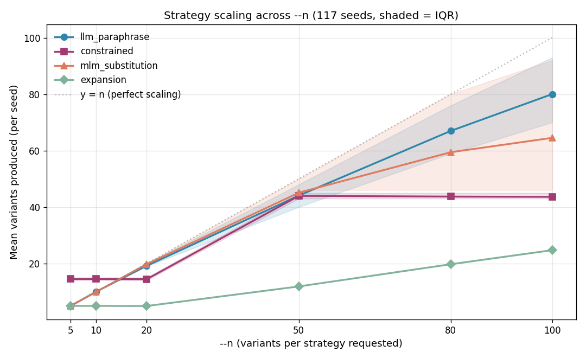
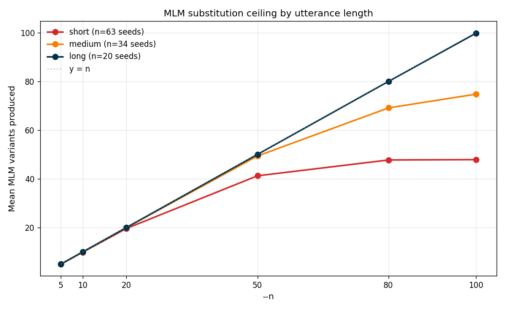
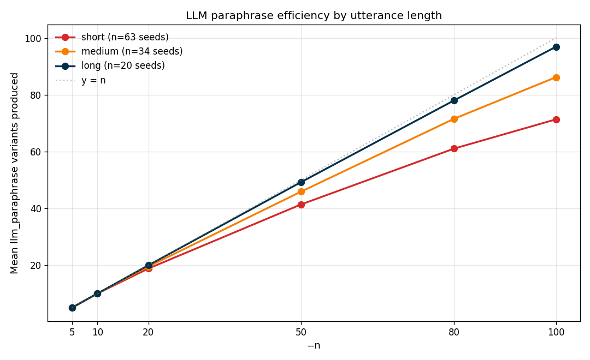
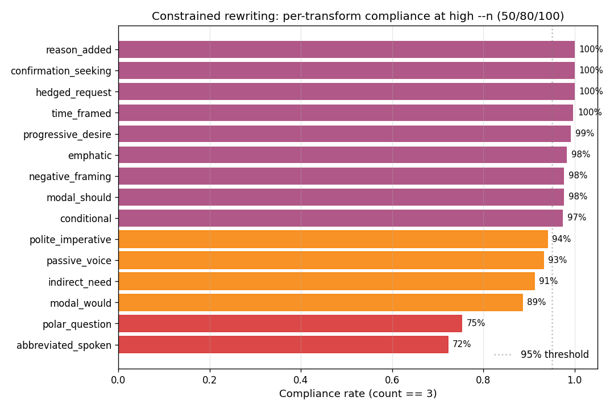

# Volume sweep: per-strategy scaling behavior

This study measures how many variants each of allo's four generation strategies actually produces as the `--n` parameter scales.

## Method

The sweep ran the full allo pipeline on 117 seeds from `evaluation/allo_seed_set.csv` at six values of `--n` (5, 10, 20, 50, 80, 100), producing 2,808 `(seed, n, strategy)` observations. All runs used the default configuration: temperature 0.9, `include_expansion=True`, `gpt-4o-mini` as the LLM backend.

Seeds span 12 domains, 7 syntactic types, and 3 utterance-length buckets (63 short, 34 medium, 20 long). Length buckets are defined by word count: short ≤ 9 words, medium 7–12 words, long 13–20 words.

Run scripts live in `evaluation/studies/`:

- `volume_sweep.py` — the runner that produces per-`(seed, n)` allo CSVs and writes the aggregate table
- `volume_sweep_analysis.ipynb` — the analysis notebook that produced the tables and figures in this document

The raw aggregate (`volume_sweep_aggregate.csv`) lives alongside the run's per-seed output CSVs under `evaluation/runs/`, which is gitignored. The summary table and all figures are committed under `evaluation/results/volume_sweep/`.

## Headline: per-strategy scaling

Mean variants produced per seed, by `--n`:

| `--n` | llm_paraphrase | constrained | mlm_substitution | expansion | total |
|------:|---------------:|------------:|-----------------:|----------:|------:|
|     5 |              5 |          15 |                5 |         5 |    30 |
|    10 |             10 |          15 |               10 |         5 |    40 |
|    20 |             19 |          14 |               20 |         5 |    58 |
|    50 |             44 |          44 |               45 |        12 |   145 |
|    80 |             67 |          44 |               59 |        20 |   190 |
|   100 |             80 |          44 |               65 |        25 |   214 |

The four strategies show four distinct scaling curves:

- **Constrained rewriting** caps at ~14.5 for `--n < 45`, then at ~43.6 for `--n ≥ 50`. The plateaus reflect the `n_per_constraint = min(3, n_per_strategy // 15)` logic: one variant per transform until `--n` reaches 45, three per transform thereafter. 15 transforms × 3 variants = 45, which matches the observed ceiling.
- **LLM paraphrasing** and **MLM substitution** both track linearly up to `--n = 50`, then diverge from the `y = n` line. By `--n = 100` they return about 80% and 65% of the request respectively — but this aggregate picture obscures strong length-gating. Sections below unpack it.
- **Expansion** scales cleanly on its `max(5, n // 4)` schedule, producing ~5 variants at `--n ≤ 20` and rising linearly above that.

Raw per-statistic summary: `scaling_summary.csv`.

## MLM substitution has a mechanical length-gated ceiling

MLM substitution generates variants by masking each content word in the seed and collecting DistilBERT's top predictions. Its output is bounded by *utterance length × valid candidates per position*. Short seeds simply have fewer maskable slots.

| length | seeds | `--n=50` | `--n=80` | `--n=100` |
|:-------|------:|---------:|---------:|----------:|
| short  |    63 |     41.2 |     47.7 |      47.9 |
| medium |    34 |     49.4 |     69.1 |      74.7 |
| long   |    20 |     50.0 |     80.0 |      99.7 |

Short seeds saturate around 48 variants regardless of --n. Mean count on short seeds is flat around 47–48 from --n = 80 onwards (48.0 at both 80 and 100), and the median is stable at 48–50 — a hard structural ceiling, not a soft dropoff. Medium seeds cap later, around 75 variants. Long seeds (13–20 words) show essentially no ceiling within --n ≤ 100: median count of 100, and 17 of 20 long seeds returned exactly 100 variants at --n = 100.

The ceiling is a property of the utterance, not of the strategy, and asking MLM for more variants than the utterance can support is structurally impossible.

## LLM paraphrasing shows a similar curve for a different reason

The aggregate plot shows `llm_paraphrase` underperforming its target at high `--n` — ~80% of the request at `--n = 100`. A natural first guess would be that the 10-at-a-time batching is producing redundancy across batches. But per-length breakdown tells a different story.

| length | seeds | `--n=50` efficiency | `--n=80` efficiency | `--n=100` efficiency |
|:-------|------:|-------------------:|-------------------:|--------------------:|
| short  |    63 |                83% |                76% |                 71% |
| medium |    34 |                92% |                89% |                 86% |
| long   |    20 |                98% |                98% |                 97% |

Long seeds return essentially what's requested even at `--n = 100` (median count of 98). Short seeds plateau at 71% efficiency. This is a content ceiling rather than a mechanical one: the model cannot produce 100 distinct natural paraphrases of a 3-word utterance like "turn it up" or "track my run." There are only so many ways to say exactly the same thing. Users asking for 100 paraphrases of a short seed should expect to receive fewer.

The fraction of (seed, `--n`) pairs where `llm_paraphrase` returned exactly `--n` variants drops with scale: 100% at `--n ∈ {5, 10}`, 58% at `--n = 20`, 14% at `--n = 50`, 7% at `--n = 80`, and under 3% at `--n = 100`. The short tail dominates this number.

## Constrained rewriting: two transforms struggle at high `--n`

At --n ≤ 20, n_per_constraint = 1 — one variant per transform per seed. Most transforms produce at least one variant on most seeds: five transforms (conditional, confirmation_seeking, modal_should, hedged_request, reason_added) achieve 100% compliance, and all but two exceed 97%. The two that don't — polar_question (79%) and abbreviated_spoken (88%) — are the same transforms that struggle most at high --n, for the same underlying reasons explained below.
At --n ≥ 50, n_per_constraint = 3. Compliance drops further for specific transforms, as explained below.

| transform | compliance (count == 3) |
|:----------|------------------------:|
| abbreviated_spoken | 72% |
| polar_question | 75% |
| modal_would | 89% |
| indirect_need | 91% |
| passive_voice | 93% |
| polite_imperative | 94% |
| conditional | 97% |
| modal_should | 98% |
| negative_framing | 98% |
| emphatic | 98% |
| progressive_desire | 99% |
| time_framed | 100% |
| reason_added | 100% |
| hedged_request | 100% |
| confirmation_seeking | 100% |

Two transforms fall below 80% compliance:

- **`abbreviated_spoken`** — asks the model to produce a shorter, more colloquial form. Compliance at high --n is 100% on long seeds, 72% on medium, and 62% on short seeds, suggesting the transform's structural difficulty scales inversely with utterance length: short seeds don't leave room for three distinct shortenings, so the model typically returns one or two (95% of failures are count = 1 or 2, not 0). Register is not a clean signal here — formal seeds actually had the highest compliance at 86%, above both colloquial (67%) and neutral (72%), though the formal sample is small (36 observations).
- **`polar_question`** — asks for a yes/no question rewrite. This fails systematically on seeds that are already interrogative: at low --n, 88% of polar_question seeds and 41% of wh_question seeds produce zero variants for this transform, compared to 1% or less for every other syntactic type. Across the full sweep, polar_question produced zero variants 77 times in total — 95% of those zero instances are on seeds whose syntactic_type is already polar_question or wh_question. The model cannot meaningfully transform what's already the target structure.

The four transforms that hit 100% compliance all *add content* (`reason_added`, `time_framed`, `hedged_request`, `confirmation_seeking`) rather than *restructuring* the seed. Additive transforms have more degrees of freedom than structural ones, so three distinct realizations are always available.

## Open question: speech disfluencies and LLM yield

The 117-seed set includes 10 seeds carrying `speech_phenomena` tags (filled pauses, false starts, self-corrections, repetitions). Of the two long seeds with phenomena tags (IDs 106 and 111), both landed near the bottom of the long-seed `llm_paraphrase` distribution at `--n = 100`: seed 111 ("can you um turn off the lights...") returned 87 variants, the lowest of any long seed.

Sample size of 2 is not enough for a claim, but the pattern is worth flagging. One plausible hypothesis: the model has to decide whether to preserve the disfluency or normalize it, which fragments the output distribution and reduces distinct-variant yield. Testing this would require a dedicated sub-study with more disfluency-tagged seeds matched against clean controls of equivalent length.

## Implications for the README and docstrings

1. **Replace the hand-waved volume estimates** in `generate_variants()` with the measured table above. The previous docstring claims (e.g. "n=50: ~150 variants") are rough but directionally correct; the measured values give real bounds.
2. **Revise the MLM "plateaus around 30" claim** in the README. The observed ceilings are length-dependent: ~48 for short, ~75 for medium, unbounded within `--n ≤ 100` for long.
3. **Document `--n` efficiency as length-dependent** in a new README subsection. Users asking for 100 paraphrases of a 3-word utterance should expect to receive ~70, not 100.
4. **Add `abbreviated_spoken` and `polar_question` to known limitations.** These transforms have meaningful compliance issues at high `--n` and on certain seed types, and users should know to expect dropouts.
5. **Keep constraint-customization on the future-enhancements list.** The ability to disable transforms that systematically fail on certain seed types (e.g. skip `polar_question` when the seed is already interrogative) would improve the per-seed yield without changing any other strategy.

## Files

- `scaling_curves.png` — headline scaling plot
- `mlm_ceiling_by_length.png` — MLM mechanical ceiling
- `llm_ceiling_by_length.png` — LLM content ceiling
- `transform_compliance.png` — constrained rewriting compliance bar chart
- `scaling_summary.csv` — per-(n, strategy) mean/median/p25/p75/min/max

All four plots and the summary CSV are produced by `evaluation/studies/volume_sweep_analysis.ipynb` and are regenerated whenever the notebook is re-run against an updated aggregate.